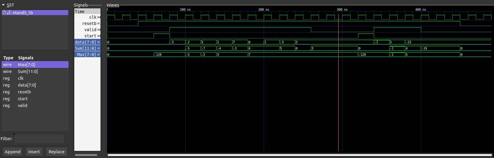

# MandS
A high energy efficiency flow calculation(max and sum) circuit:

- `verilog/`: Verilog design
- `hspice/`: Hspice design
- `readings/`: reading materials
- `figs/`: pictures

## Background
传感器信号的特征提取是很多物联网应用中的常用运算，传感器信号通常经过模数转换后变成数字序列，以串行的方式进入系统，其到达率一般等于模数转换器的采样率，由信号带宽和应用决定. 设计一款流数据的特征提取电路，该电路接收串行到达的数据流信号，能够计算接收到的全部信号的序列和与最大值，从序列中提取出需要的信息. 信号到达速率给定，要求该电路具有尽量高的能量效率——即处理一组数据所消耗的总能量最小化. 其中，需要考虑不同应用场景中传感器信号的采样率的差异和电路工作的鲁棒性(能够适应电压的波动范围)

## Specification
### Functions
序列数据`data`在时钟信号`clk`驱动下依次串行输入, 每个序列元素是一个8位的二进制补码表示的有符号整数, `valid`是指示信号, `data`上的数据只在`valid`为1的时钟周期内才是有效的. MandS在每个序列输入结束(`valid`下降后)会在输出端口同时输出收集序列的最大值`Max`和序列和`Sum`. `start`信号是新序列开始的标志信号: 当读到`start`=1时, 则会把`Max`, `Sum`都复位, 并清除内部状态, 准备重新计算新的序列. 上述`data`, `valid`, `start`信号和`Max`/`Sum`数据都是时钟上升沿变化, 上升沿采样. `resetb`是整个系统的复位信号, 低有效, 为异步复位

实现流计算的晶体管级电路设计，功能单元(MandS)及典型的工作波形如下所示:

在一个序列开始之前, 前级电路先输出一个`start`脉冲初始化MandS, 然后`valid`升高, 并同时开始输入数据, 当序列输入完毕(本例中序列长度为5, 实际中的序列长度任意，由`valid`信号的持续周期决定), `valid`信号下降. 当MandS后级电路采样到`valid`=0, 则知道结果数据已经就绪，就可以读取`Max`/`Sum`端口上的数值

### Design Requirements
- 使用SMIC 40nm低漏电工艺
- 可以选用任何一种逻辑类型、时钟技术、电路结构, 但不能更改功能描述中的接口定义
- 所有输入信号都由一个最小尺寸的驱动器(两级对称反相器串联, 第一级为最小尺寸反相器, 第2级的尺寸是它的4倍)驱动, 输入驱动器的原始输入信号翻转时间为10ps (电路功耗评估时均不包括输入驱动器部分的功耗)
- 所有输出引脚的外部负载电容都是25fF
- 输出信号的时序需要确保后级电路能够正确采样, 假设后级采样寄存器使用相同的时钟，寄存器的建立时间小于10% cycle
- 实现过程可以采用基于Cadence或HSPICE的全定制设计流程、也可以采用基于Verilog-Design Compiler的基于标准单元的设计流程、或者二者结合的混合设计流程, 但是最终结果必须是HSPICE网表形式

### Performance Requirements
- 吞吐率: 输入数据的时钟频率由应用决定, 要求本设计以同一电路支持两种采样率(320KHz, 0.8GHz). 不同工作频率下的额定电源电压可以根据需要选择, 但不能超过工艺允许的最高额定电压1.1V(不需要设计电源电压调整电路)
- 评价指标: 电路在320KHz, 0.8GHz两种时钟频率下工作的能量效率(平均功耗/吞吐率)的平均值，应使得电路的平均能量效率尽量低
- 在每种采样率下容许的电源电压波动范围都不小于±10%，要确保电路在SS corner下能够在上述采样率范围内工作
- 上述吞吐率和能量效率指标均指在25℃结温下的值
- 无计算误差
- 支持的序列长度不超过16

## Design strategy
本高能效流特征计算电路设计是基于HSPICE的全定制设计:
设计初期，根据电路功能描述初步拟定电路结构，之后使用Verilog进行结构化建模，编写testbench利用iverilog与Vivado实现简单的逻辑功能验证

以通过验证的电路为基础进行晶体管级描述，使用HSPICE实现自底向上的电路实现：先构建、验证基本的电路子模块，如反相器inv，传输门transgate以及二选一多路选择器mux21等；之后搭建MandS05顶层子电路，并编写testbench，完成网表的功能验证

优化testbench，通过`.param`扫描两种时钟频率下的电源电压，完成对电路功耗的测量与优化

- Max寄存器的默认值为置为8’b10000000，保证输入负数时正确的到最大值
- 利用传输门实现MUX与DFF，降低了功耗
- 采用串行进位加法器，满足时序，功耗低
- 复用了加法器和MUX实现比较器，降低了功耗和复杂度

## Verilog design 
### Dirs
- [verilog/rtl/](./verilog/rtl/): the structural modeling rtl code
- [verilog/tb/](./verilog/tb/): testbench
- [verilog/sim](./verilog/sim/): python script and waveform

### Verification
- create testbench [MandS_tb.v](./verilog/tb/MandS_tb.v) and python script [run_sim.py](./verilog/sim/run_sim.py) to run iverilog verification and check the waveform through GTKWave
- run the verification by command: `python ./sim/run_sim.py MandS`
- the result is shown below:

## Architecture
电路有两Sum与Max两条主要逻辑路径. u_comparator为8位数据比较器，u_adder为12位ripple-carry串行加法器，u_max_reg为保存Max结果的寄存器，u_sum_reg为保存Sum结果的寄存器，4个多路选择器实现控制信号. 顶层模块如下所示:

8位数据的比较器: 若符号位不同，则输出符号位为0的数据；若符号位相同，通过8位全加器计算补码减法 a - b = a + ~b + 1，根据减法结果通过多路选择器来选择大值输出:

最后，异步低电平复位的D触发器的实现（Hspice测得建立时间约22ps）:

## Hspice design 
### Dirs
- [hspice/library/](./hspice/library/): the component and testbench
- [hspice/src/](./hspice/src/): design source and testbench of MandS
- [hspice/test/](./hspice/test/): results(netlist, waveforms...)

### Results
为了确保电路在SS corner下容许的电源电压波动范围都不小于±10%，因此在SS corner下进行电压扫描，得到能够后级正确采样的临界电压V，把(V/90%)的值作为最终电压选择，部分结果如下:

最终电源电压选择与在TT corner下的平均功耗、能量效率平均值:

TT corner下的典型波形(左: 320KHz典型波形   右:0.8GHz典型波形):

